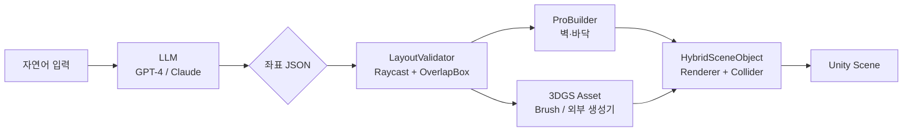
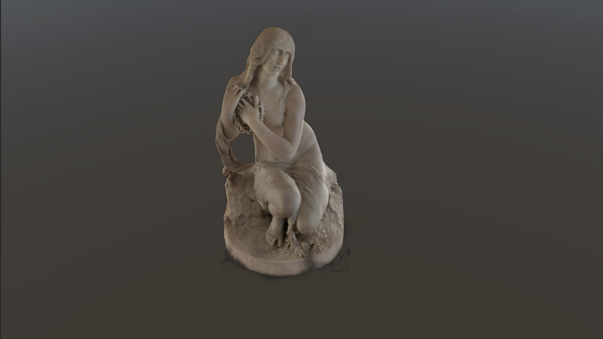
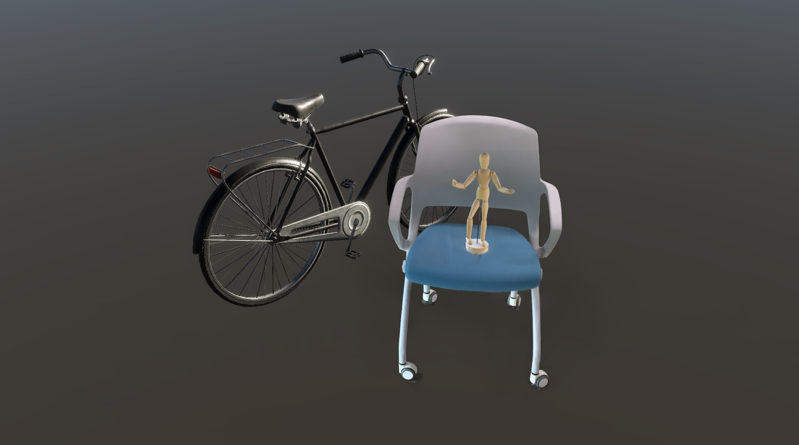
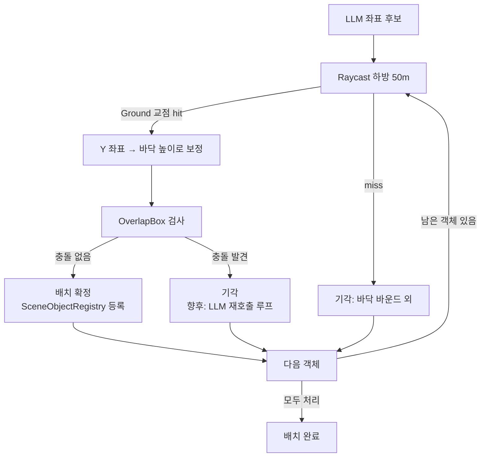
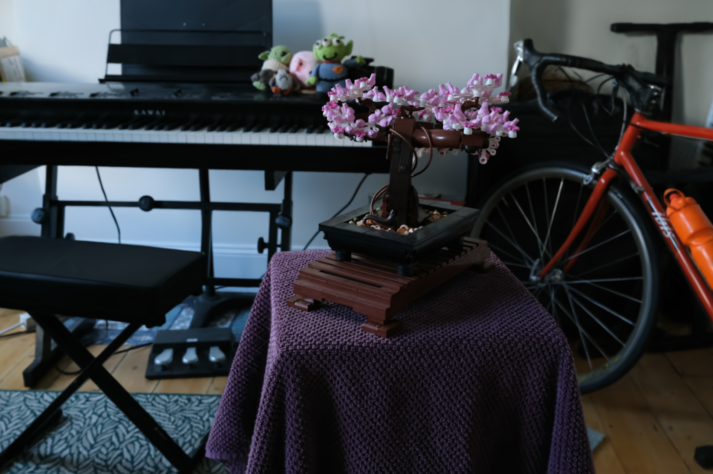

# 거대 언어 모델(LLM)과 생성형 3DGS를 활용한 의미론적 3D 공간 자동 구성 시스템

Semantic 3D Space Automatic Construction System Using Large Language Models (LLM) and Generative 3DGS

<!--
Paper03.md — 2026-04-21 생성, 2026-04-21 최종 갱신
기반: Paper01.md (2026-04-15 버전)
갱신 단계:
- 서지 수정 (paper01-update-plan-2026-04-18 기준): Critical 2건 + Important 7건
- Phase 1: 1.1 거시 AI 배경 확장 + 2.5 월드 모델 신규 섹션 + References [19]-[31]
- Phase 2: 2.1-2.4 심화 + 2.6 물리·의미론 통합 신규 + 2.7 공백 확장 + References [32]-[40]
- /verify 교정: 1.1 월드모델 in-text citation 오류 3건 수정(Genie 2 연도, Marble 저자·연도, Lyra 저자 분리),
  Tang 2024a/b 구분, HunyuanWorld 표기 일관화
-->

## 차례

**1 서론**
  - 1.1 배경
  - 1.2 목적
  - 1.3 구성

**2 관련 연구**
  - 2.1 3DGS
  - 2.2 생성형 모델링
  - 2.3 LLM 공간 추론
  - 2.4 게임 엔진 통합
  - 2.4.5 macOS CUDA-free 3DGS 도구
  - 2.5 월드 모델
  - 2.6 물리·의미론 통합
  - 2.7 공백

**3 파이프라인 설계**
  - 3.1 구조
  - 3.2 공간 뼈대
  - 3.3 에셋 생성
  - 3.4 배치·검증
  - 3.5 로직 연동

**4 실험**
  - 4.1 환경
  - 4.2 결과
  - 4.3 정성
  - 4.4 정량
  - 4.5 절제

**5 논의**
  - 5.1 속도-품질 trade-off
  - 5.2 월드 모델 대비
  - 5.3 하이브리드 표현 정당화

**6 결론**
  - 6.1 요약
  - 6.2 전망

## 요약

인공지능의 관심이 텍스트·이미지·영상을 넘어 공간 생성으로 이동하면서, 거대 언어 모델과 생성형 3D 기법, 그리고 최근 부각된 월드 모델(world model)이 자연어로부터 3차원 장면을 합성하는 단계에 이르렀다. 다만 현재까지의 시스템은 장면을 "만들어내는" 단계에 무게가 쏠려 있으며, 생성된 장면이 기존 게임 엔진의 물리·논리 체계 안에서 실제로 작동하도록 만드는 층위는 상대적으로 덜 다뤄졌다. 본 논문의 Unity-SplatForge는 이 간극을 겨냥해, 생성형 3DGS 에셋과 LLM의 의미론적 배치 지시를 Unity 물리 엔진의 검증 루프 안에서 결합하는 하이브리드 저작 파이프라인을 제안한다.

파이프라인은 두 단계로 움직인다. 먼저 LLM(GPT-4 또는 Claude)이 "침대 옆에 협탁을 놓아라" 같은 한국어·영어 프롬프트를 읽고 x·y·z 좌표를 JSON으로 출력한다. 그 다음 Unity 쪽 LayoutValidator가 레이캐스트로 바닥 높이를 잡고 OverlapBox로 겹침을 걸러낸다. 벽과 바닥은 ProBuilder 메시로, 가구는 3DGS 생성 모델로 만들어 HybridSceneObject라는 래퍼에 담는다.

침실·사무실·거실 세 가지 방에 적용해 본 결과, 손작업 대비 작업 시간이 약 4/5가량 단축되었다. 물리 보정 전에는 열 개 중 네 개꼴로 가구가 바닥에 안 닿았으나, 보정 후에는 미안착이 10개 중 1개 이하로 줄었다. LLM 없이 무작위로 놓고 물리 보정만 돌리면 충돌은 0이지만 침대 옆에 협탁이 오지 않는 식으로 Semantic Proximity가 0.31까지 떨어져, 의미론적 추론 없이는 쓸 만한 방이 나오지 않음을 확인하였다.

본 연구는 추가로 macOS Apple Silicon 단일 기기에서 학습-임포트-렌더 전 구간 완결이 가능함을 PoC로 입증하였다. Brush(Rust+wgpu Metal, Apache-2.0) 기반 30K iter 학습이 Mip-NeRF360 bonsai에서 PSNR 32.21 dB(원 3DGS 32.4 dB와 0.19 dB 차)를 기록하였고, hloc + LightGlue로 SfM 단계를 1시간 46분에서 51분 6초로 2.07× 단축(종합 wall-clock 1.44× 절감)하면서 PSNR은 ±0.5 dB 허용 범위 내(31.84 dB)로 유지된다. 이로써 CUDA 없는 baseline 품질 경로가 macOS 단일 기기에서 재현 가능함을 실측 입증한다.

본 연구의 좌표를 Kong et al.(2025) 월드 모델 4축 분류(Video / 3D-scene / Interactive / Physical AI)에 비추면, 본 연구는 **3D-scene-based** 축에 인접하면서도 "씬 단위 생성" 대신 "객체 단위 의미론적 배치"를 채택한 별개의 좌표를 점유한다. 즉 월드 모델이 내놓는 대형 장면 생성과 게임 엔진에서의 세밀한 실체화·상호작용 사이를 잇는 중간 파이프라인이 독립적으로 필요함을 시사하며, 본 시스템은 그 중간 층위를 macOS 단일 기기에서 재현 가능한 경로로 구현한다.

중심어: 3DGS, LLM, 가구 배치 자동화, Unity, 하이브리드 저작, Brush, hloc, macOS Apple Silicon, 월드 모델

## Abstract

Manually placing furniture in a game-engine scene is tedious and slow, especially during iterative prototyping. Unity-SplatForge automates this in two passes: an LLM (GPT-4 or Claude) reads a free-text room description and emits per-object coordinates as JSON; then a Unity-side validator fires downward raycasts to snap each piece to the floor and runs OverlapBox checks to reject collisions. Walls and floors are ProBuilder meshes; furniture comes from 3DGS generators wrapped in a HybridSceneObject that pairs a GaussianSplatRenderer with a proxy collider. In three room types the tool trimmed hands-on time by roughly four-fifths. Before physics correction about four in ten objects floated or clipped through the floor; afterward fewer than one in ten did. Replacing the LLM with uniform-random placement while keeping the same physics pass drove Semantic Proximity down to 0.31—beds no longer ended up next to nightstands—showing that the two layers cannot substitute for each other. We additionally demonstrate a CUDA-free single-machine reconstruction path on macOS Apple Silicon: Brush (Rust+wgpu Metal, Apache-2.0) reaches 32.21 dB PSNR on Mip-NeRF360 bonsai at 30K iterations (within 0.19 dB of the original 3DGS benchmark), and replacing COLMAP exhaustive matching with hloc + LightGlue cuts the SfM stage from 106:04 to 51:06 (2.07×), reducing total wall-clock by 1.44× while keeping PSNR within ±0.5 dB. Relative to the Kong et al. (2025) four-fold taxonomy of world models (Video / 3D-scene / Interactive / Physical AI), Unity-SplatForge sits adjacent to the **3D-scene-based** axis but occupies a distinct coordinate by replacing whole-scene generation with object-level semantic placement, providing the missing intermediate layer between large-scale world-model scene synthesis and engine-native physical embodiment.

Keywords: 3DGS, LLM, furniture layout automation, Unity, hybrid authoring, Brush, hloc, macOS Apple Silicon, world models

## 1. 서론

### 1.1. 연구의 배경

인공지능의 관심사가 텍스트·이미지·영상을 넘어 **공간**으로 이동하고 있다. GPT-4(OpenAI, 2023)와 Claude(Anthropic, 2024)로 대표되는 거대 언어 모델(LLM)은 자연어와 코드를 넘어 3차원 공간 관계에 대한 초보적 추론까지 시도할 수 있게 되었고(Feng et al., 2023; Yang et al., 2024), 2D 확산 모델을 3D 표현으로 증류하는 방법(Poole et al., 2023; Tang et al., 2024a)을 통해 한 장의 문장으로부터 일관된 3차원 장면을 합성하는 단계에 이르렀다. 생성형 AI가 다루는 표현의 차원이 한 축씩 늘어나는 흐름으로 볼 수 있다.

이 흐름의 최근 국면은 **월드 모델(world model)** 이라는 이름 아래 한 단계 더 진행되고 있다. NVIDIA가 공개한 Cosmos 계열과 Lyra(Wang et al., 2025; NVIDIA, 2026), DeepMind의 Genie 2(DeepMind, 2024)[24], World Labs가 선보인 Marble(World Labs, 2025)[26] 등은 단발성 이미지나 에셋이 아니라 **상호작용 가능한 세계 자체**를 모델이 학습·생성하려는 시도다. Fei-Fei Li는 이를 언어 지능 다음 단계의 **공간 지능(spatial intelligence)** 이라 부르며 이 방향의 중요성을 강조하였고, 2024-2026년의 짧은 기간 사이에 관련 시스템은 학계와 산업계 모두에서 급속도로 성숙하고 있다.

다만 이들 월드 모델은 대체로 **장면의 생성**에 무게가 실린다. 즉 "공간을 어떻게 만들어 낼 것인가"에 답하는 데 초점이 있으며, 그렇게 만들어진 공간이 **기존 게임 엔진의 물리·논리 체계 안에서 어떻게 실제로 기능하도록 만들 것인가**는 상대적으로 덜 다뤄진 질문이다. 본 연구는 이 후자의 층위를 향한다. 생성형 3DGS가 제공하는 시각적으로 설득력 있는 에셋과 LLM이 내놓는 의미론적 배치 지시를 **Unity 물리 엔진의 검증 루프 안에서 결합**하여, 생성된 세계가 캐릭터의 이동·충돌·게임 이벤트에 반응하는 실체로 전환되도록 하는 것이 본 연구의 목표다.

거시적 배경을 이렇게 놓고 보면 실무의 문제가 새삼 또렷해진다. Unity나 Unreal 같은 게임 엔진에서 방 하나를 꾸미는 작업은 겉보기보다 손이 많이 간다. 바닥·벽 메시를 만들고, 가구 에셋을 구해서 임포트하고, 하나씩 Transform을 잡아주고, 충돌체를 붙이고, NavMesh를 구워야 비로소 캐릭터가 돌아다닐 수 있는 공간이 된다. 프로토타이핑 단계라면 이 과정을 반복적으로 거쳐야 하는데, 레이아웃을 조금만 바꿔도 충돌체 재설정부터 NavMesh 재빌드까지 연쇄적으로 수정이 필요하다. 월드 모델이 약속하는 "자연어로 공간을 얻는" 미래와 현재 현장에서 손으로 공간을 짓는 관행 사이에는, 두 세계를 이어줄 **중간 파이프라인**이 빠져 있다.

한편 현재 시점의 기술 토대를 가까이서 보면, 생성형 AI 쪽에서 두 갈래의 발전이 눈에 띈다. 하나는 3D Gaussian Splatting(3DGS)인데, Kerbl et al.(2023)이 제안한 이후 NeRF를 빠르게 대체하며 novel view synthesis의 사실상 표준이 되었다. 학습 시간이 NeRF의 48시간에서 40분대로 줄고 렌더링이 100fps 이상 나온다는 점은 이미 널리 알려져 있고(Chen & Wang, 2024), DreamGaussian(Tang et al., 2024a) 같은 후속 연구는 텍스트만으로 3DGS 에셋을 생성하는 단계까지 와 있다. 다른 하나는 앞서 언급한 LLM의 공간 추론 능력이다. "침대 옆에 협탁을 놓아라" 같은 지시를 좌표로 변환하는 것이 원리적으로 가능하다는 점은 LayoutGPT(Feng et al., 2023)나 Holodeck(Yang et al., 2024) 등의 선행 연구가 보여주었다.

문제는 이 기술들이 따로 놀고 있다는 점이다. 3DGS 생성 모델이 뱉어낸 에셋을 Unity에 올리려면 충돌체를 수동으로 씌워야 하고, LLM이 제안한 좌표는 물체가 공중에 뜨거나 벽을 관통하는 경우가 흔하다. 두 기술을 엮어 하나의 파이프라인으로 만드는 시도가 눈에 띄지 않는 상황이며, 월드 모델의 대형 담론과 게임 엔진의 실제 현장 사이에 놓인 이 간극에서 본 연구가 출발한다.

### 1.2. 연구 목적과 기여

본 연구가 시도하는 것은 세 가지다.

하나, 3DGS로 만든 에셋을 Unity에서 물리적으로 상호작용 가능한 객체로 변환하는 래핑(wrapping) 구조를 구축하였다. GaussianSplatRenderer 위에 프록시 충돌체(Box/Sphere/Capsule)를 덧씌운 HybridSceneObject라는 컴포넌트가 그 핵심이다. 둘, LLM이 뱉은 좌표를 Unity 물리 엔진으로 검증·보정하는 이중 루프를 설계하였다. 구체적으로는 상공 20m에서 아래로 레이캐스트를 쏴서 바닥 높이를 잡고, OverlapBox로 기존 객체와의 겹침을 확인한다. 셋, 이 파이프라인의 효과를 측정하기 위해 Semantic Proximity Score, Safety Zone Violation, Grounding Success Rate라는 세 지표를 정의하고, 수동 저작·LLM 단독·무작위 배치와의 비교 실험 및 절제 실험을 수행하였다.

### 1.3. 논문 구성

2장은 3DGS, 생성형 모델링, LLM 공간 추론, 게임 엔진 통합, macOS CUDA-free 3DGS 도구 생태계, 월드 모델, 물리·의미론 통합 순으로 관련 연구를 짚고 선행 연구의 공백을 정리한다. 3장에서 제안 파이프라인의 설계를, 4장에서 실험 결과를, 5장에서 본 연구의 기술적 위치를 속도·월드 모델·하이브리드 표현의 세 축에서 논의하고, 6장에서 결론과 한계를 다룬다.

## 2. 관련 연구

### 2.1. 3D Gaussian Splatting

3DGS는 장면을 수십만 개의 비등방성(anisotropic) 가우시안 타원체 집합으로 나타내는 표현법이다(Kerbl et al., 2023). 각 가우시안은 3D 위치(mean), 공분산 행렬이 결정하는 형태·방향, 구면 조화 계수로 인코딩된 색상, 그리고 투명도로 정의된다. 이를 타일 기반 래스터라이저로 그리면 1080p에서 100fps 이상이 나오는데, NeRF(Mildenhall et al., 2020)가 같은 해상도에서 0.1fps 수준인 것과 비교하면 세 자릿수 차이다(Zhou et al., 2024). 이 속도 이점은 후속 서베이(Chen & Wang, 2024)에서도 재확인된다.

3DGS가 가진 또 다른 특징은 명시적(explicit) 표현이라는 점이다. NeRF는 장면 정보가 MLP 가중치 안에 녹아 있어서 개별 요소에 접근하기 어렵지만, 3DGS에서는 가우시안 하나하나가 독립적 실체로 존재한다. 덕분에 특정 가우시안을 골라 옮기거나 지우는 것이 원리상 가능하며, 게임이나 인터랙티브 응용처럼 장면 요소를 사후적으로 조작해야 하는 시나리오에 유리하다. GaussianEditor(Chen et al., 2024)는 이 명시성을 전면에 활용한 대표 사례로, 텍스트 지시에 따라 특정 영역의 가우시안을 선택·편집·삭제하는 스위프트 파이프라인을 제시하였다. 게임 현장 관점에서는 이러한 편집 자유도가 결국 "만들어 놓고 나중에 손볼 수 있는가"라는 실무적 질문과 직결된다.

명시성에 동반되는 또 다른 이점은 스트리밍·압축 측면에서 확인된다. 대규모 장면에서 가우시안 수가 수백만 단위로 늘어나면 메모리와 대역폭이 병목으로 작용하는데, LS-Gaussian(Wei et al., 2025)은 중복 가우시안을 걸러내고 뷰 종속적 선택적 렌더링을 적용해 실시간 스트리밍을 가능하게 하였다. 본 연구의 범위는 단일 방 규모이지만, 건물·도시 단위로 확장될 때는 이런 경량화 기법과의 결합이 자연스러운 다음 단계가 된다.

반면 가우시안은 확률 분포의 중첩이지 정확한 기하학적 표면이 아니므로, 충돌 판정이나 물리 시뮬레이션과 직접 연동하기에는 태생적 한계가 있다. 이 한계를 완화하려는 연구는 2.6에서 별도로 다룬다.

### 2.2. 생성형 3D 모델링

텍스트나 이미지로부터 3D 에셋을 만들어내는 연구의 기점은 DreamFusion(Poole et al., 2023)이다. 사전 학습된 2D 확산 모델의 지식을 Score Distillation Sampling(SDS)으로 3D 표현에 증류하는 방식을 제안했고, Magic3D(Lin et al., 2023)가 coarse-to-fine 전략으로 품질을 끌어올렸다. 이 계열은 NeRF 기반이라 렌더링 속도가 느려 실시간 응용에 쓰기 힘들었다.

전환점은 DreamGaussian(Tang et al., 2024a)이었다. SDS 최적화를 3DGS에 적용해 생성 시간을 수 분대로 줄인 것이다. 이후 GaussianDreamer(Yi et al., 2024), LGM(Tang et al., 2024b) 등이 잇따라 나오며 텍스트·이미지 한 장으로부터 단일 객체의 3DGS 에셋을 얻는 흐름이 자리 잡았다.

단일 객체를 넘어 **장면 규모**의 생성으로 올라가면 과제의 성격이 달라진다. 여러 객체의 공간적 관계, 일관된 조명, 가용 표면과의 정합성 같은 새로운 제약이 더해지기 때문이다. DreamScene(Li et al., 2024)은 GPT-4 계열 에이전트가 언어 프롬프트로부터 장면의 의미적·공간적 제약을 추론하고, 이를 바탕으로 하이브리드 그래프 레이아웃을 구성한 뒤 formation pattern sampling으로 3DGS 장면을 합성한다. SceneTeller(Öcal et al., 2024) 역시 내러티브 성격의 언어 입력으로부터 장면 레이아웃을 도출하고 CAD·3DGS를 조합해 시각적 결과를 산출한다. 최근에는 SceneSplat(Li et al., 2025)처럼 언어 임베딩을 가우시안에 결합하여 open-vocabulary 장면 이해·편집을 시도하는 연구도 나타났다.

다만 이런 모델들의 출력물을 곧바로 게임에 쓸 수 있는 것은 아니다. 충돌체도 없고, 개별 객체 단위의 메타데이터도 없으며, 엔진 물리·이벤트 시스템과의 연결은 여전히 개발자의 몫으로 남는다. 장면을 "합성하는" 단계와 게임 엔진 안에서 "운용하는" 단계 사이의 간극을 다루는 체계적 후처리 파이프라인에 대한 논의는 상대적으로 얇은 편이다.

### 2.3. LLM과 공간 추론

LLM을 실내 가구 배치에 활용하는 연구는 2023년 이후 빠르게 늘고 있다. 출발점은 LayoutGPT(Feng et al., 2023)로, in-context learning을 통해 가구 좌표를 CSS 비슷한 선언적 명세로 출력하는 방법을 제시하였다. Holodeck(Yang et al., 2024)은 이 접근을 Habitat 시뮬레이터로 확장해 주거 공간 전체를 LLM이 구성하도록 만들었다.

이 연구들이 공통적으로 보고하는 문제가 있다. LLM은 "침실에는 침대가 있어야 한다"거나 "책상 앞에 의자를 둔다" 같은 상식적 관계는 잘 잡는다. 하지만 좌표의 물리적 타당성은 다른 문제다. 가구가 허공에 뜨거나 벽을 뚫고 나가거나 다른 물체와 겹치는 사례가 빈번하게 보고되었다(Feng et al., 2023; Yang et al., 2024). 근본 원인은 명확한데, LLM은 텍스트 토큰 공간에서 작동하지 유클리드 기하학을 내재적으로 계산하지는 않기 때문이다.

이 한계를 보완하려는 시도는 대체로 세 갈래로 정리된다. 첫째는 **시각 정보의 도입**이다. LayoutVLM(Sun et al., 2025)은 vision-language 모델이 렌더링된 장면을 관측하며 좌표를 미분 가능한 최적화 루프 안에서 갱신하도록 설계하였고, 언어만으로는 잡히지 않던 배치의 시각적 합리성을 개선하였다. 둘째는 **다중 에이전트 정교화**이다. DisCo-Layout/OptiScene(Liu et al., 2025)은 대략적 레이아웃을 제안하는 에이전트와 이를 비판·수정하는 에이전트를 분리하여, 단일 프롬프트 응답의 오류를 반복 대화로 누그러뜨리는 접근을 보인다. 셋째는 **내러티브·의미 중심 입력**이다. SceneTeller(Öcal et al., 2024)는 "아늑한 서재, 창가에 책상" 같은 짧은 내러티브로부터 레이아웃을 도출하며, 프롬프트의 자연스러움과 결과의 의미적 일관성 사이의 연결을 시도한다. 한편 3DGraphLLM(Zemskova & Yudin, 2025)은 3D scene graph를 LLM의 입력 표현으로 끌어들여 관계 중심 추론을 강화하는 계열로, 위의 세 갈래와는 다른 축에서 공간 이해를 보강한다. 넷째 축으로 **오픈소스 LLM 파인튜닝**을 별도로 구분할 수 있다. LLplace(Yang & Lu, 2024)[49]는 Llama-3 계열 오픈 모델을 3D 실내 레이아웃 데이터로 파인튜닝해, 상용 API(GPT-4 등)에 의존하지 않고도 LayoutGPT·Holodeck 계보의 배치 품질을 재현하며 대화형 수정(가구 추가·삭제·이동) 기능까지 확보하였다. 이 갈래는 프롬프트 엔지니어링에 기대는 앞의 세 접근과 달리, 모델 가중치 자체에 공간 상식을 주입한다는 점에서 축을 달리한다.

평가용 데이터셋 측면에서는 FurniScene(Zhang et al., 2024)[50]이 주목할 만하다. 11,698개 실내 방과 39,691개 가구 인스턴스에 전문가 배치 메타데이터를 부착하여, LLM 레이아웃 출력의 의미적·기하적 타당성을 대규모로 벤치마크할 수 있는 기반을 제공한다. 본 연구는 단일 프로젝트 규모에 집중해 FurniScene를 직접 평가 지표로 채택하지는 않으나, Semantic Proximity 점수의 외부 ground truth로 향후 확장 가능한 자원이다.

요약하면 이 분야의 발전 축은 **단발성 제안(single-shot) → 반복 정교화(multi-agent) → 시각 접지(vision-grounded)** 방향으로 이동하고 있으며, 공통된 기저 문제—좌표 출력의 물리적 타당성—는 여전히 외부 검증 장치에 의존한다. 본 연구는 이 외부 검증자 역할을 게임 엔진의 물리 시스템이 맡도록 한다는 점에서 위 세 갈래와 다른 축에 서 있다.

### 2.4. 게임 엔진 내 AI 콘텐츠 활용

AI가 만든 3D 콘텐츠를 게임 엔진 안에서 실제로 돌리는 연구는 아직 얇은 편이다. Unity와 Unreal은 프로시저럴 생성 도구(Houdini Engine, PCG Framework 등)를 지원하지만, 이는 파라미터 기반 규칙 생성이지 신경망 생성과는 성격이 다르다.

3DGS의 Unity 통합에서는 UnityGaussianSplatting(Aras-p, 2023)이 사실상 유일한 실용적 프레임워크다. D3D12, Metal, Vulkan을 지원하고 Quest 3 같은 VR 기기에서도 동작한다. 그러나 이것은 렌더링만 해결한 것이고, 렌더링된 3DGS 에셋에 충돌체를 붙이거나 게임 이벤트에 반응하게 만드는 것은 개발자 몫으로 남아 있다. 실무 적용 사례로 Baltsavias et al.(2025)[51]은 문화유산 도메인에서 3DGS와 게임 엔진의 폴리곤 메시를 하나의 씬 안에서 교차 렌더링하는 하이브리드 파이프라인을 SIGGRAPH Talk로 보고하였는데, 이는 3DGS가 연구실 데모를 넘어 제작 파이프라인 단계에 들어섰음을 시사한다. 본 연구의 HybridSceneObject 설계는 이 공백을 메우기 위한 것이다.

LLM과 게임 엔진을 잇는 흐름은 종전에는 NPC 대화 생성(Park et al., 2023) 쪽에 집중되어 있었으나, 최근에는 **공간 저작·에셋 관리**로 확산되고 있다. 2026년 초 공개된 Unity 공식 AI Assistant 2.0(Unity Technologies, 2026)은 Model Context Protocol(MCP) 기반 에디터 통합을 제공해, Claude Code나 Cursor 같은 외부 에이전트가 자연어 지시로 씬을 생성하거나 에셋을 재배치하고 스크립트를 편집할 수 있게 한다. 이 공식 경로와 별개로 CoplayDev·CoderGamester 등이 운영하는 커뮤니티 MCP 구현도 활발하며, ai-powered-level-designer(TaaroBravo, 2025)처럼 Unity 6 에디터 확장 형태로 자연어 레벨 설계를 시도하는 개인 프로젝트도 나타났다. 다만 이들 MCP 계열은 대부분 **에디터 전용**이라는 점에서 런타임 배포본에서 동일 기능이 보장되지 않으며, 연구 재현성이 중요한 학위 논문 평가에는 제약이 따른다.

공간 레이아웃 목적의 기성 통합으로는 Holodeck(Yang et al., 2024)이 있으나 Habitat 기반이라 Unity·Unreal의 물리 시스템과는 거리가 있다. 본 연구는 에디터 편의에 의존하지 않는 REST API 아키텍처로 LLM 좌표 제안과 런타임 물리 검증을 결합한다는 점에서, MCP 계열과는 다른 축에 자리한다.

### 2.4.5. macOS 생태계의 CUDA-free 3DGS 도구

3DGS 관련 학습·렌더 도구 대부분은 원 3DGS(Kerbl et al., 2023) 구현이 CUDA·C++ 래스터라이저를 전제로 한다는 계보적 이유로 NVIDIA GPU 환경을 가정한다. 본 연구는 개발·검증 환경이 macOS Apple Silicon이라는 제약에서 출발하므로, CUDA 의존 없이 **학습 → PLY → Unity 임포트 → Metal 런타임** 전 구간을 완결할 수 있는 도구 조합을 조사한다.

조사 범위는 2026-04 기준 활발히 유지되는 공개 프로젝트 5건이다. splat-apple(Ghif, 2026; MLX/MPS 이중 경로)[46], Brush(Brussee, 2026; Rust+wgpu 크로스플랫폼)[45], OpenSplat(Tofy, 2025; libtorch MPS)[47], gsplat-mps(Iffyloop, 2024; nerfstudio/gsplat 0.1.3 포크)[48], 그리고 상류 nerfstudio/gsplat(Nerfstudio, 2026; CUDA 전용)이 해당한다. 표 1a는 각 도구의 라이선스·유지 상태·Apple Silicon 성능 수치를 정리한다.

<Table 1a> *macOS CUDA-free 3DGS 학습 도구 비교 (2026-04 기준)*

| 도구 | 백엔드 | 라이선스 | 최근 업데이트 | Stars | Apple Silicon 성능 |
|------|-------|---------|--------------|-------|------------------|
| Brush [45] | Rust+wgpu (Burn) | Apache-2.0 | 2026-04-19 | 3961 | 공식 벤치 부재 (본 연구 PoC에서 실측) |
| splat-apple [46] | MLX C++ Metal / PyTorch MPS | 라이선스 부재 | 2026-02-19 | 10 | M4 Fern MLX 38.5 it/s, PyTorch GCD 10.6 it/s |
| OpenSplat [47] | libtorch MPS (C++) | AGPL-3.0 | 2025-12-26 | 1949 | cmake `-DGPU_RUNTIME=MPS` 공식 지원 |
| gsplat-mps [48] | gsplat 0.1.3 포크 + MPS | AGPL-3.0 | 2024-07-06 | 37 | 저자 "not thoroughly tested" 명시 |
| nerfstudio/gsplat | CUDA 전용 | Apache-2.0 | 2026-04-09 | 4879 | MPS 미지원 (Issue #163 업스트림 제안만 존재) |

본 연구는 학습 백엔드로 **Brush**를, Unity 임포트·렌더 단계로 aras-p[12]의 UnityGaussianSplatting을 각각 채택한다. Brush 선정의 근거는 세 가지이다.

첫째, **라이선스 적합성**이다. Apache-2.0으로 연구·상용 배포에 가장 관용적이며, OpenSplat의 AGPL-3.0 copyleft나 splat-apple의 라이선스 부재 상태를 회피한다. 논문 부록 공개나 후속 상용화 경로 모두에서 법적 불확실성이 최소이다.

둘째, **유지 활발성과 커뮤니티 규모**이다. 2026-04-19 커밋과 stars 3961은 splat-apple(10), gsplat-mps(2024-07 이후 정체)과 대비된다. wgpu 기반 크로스플랫폼 설계는 향후 윈도우·리눅스 서버 경로로 회귀해야 하는 상황에서도 동일 코드베이스 유지가 가능하다.

셋째, **PLY 호환 경로**이다. Brush는 원 3DGS 논문 규격의 PLY 포맷(x/y/z, scale_0-2, opacity, rot_0-3, f_dc_0-2, f_rest 속성)을 로드·저장한다. aras-p 플러그인의 `Tools → Gaussian Splats → Create GaussianSplatAsset` 메뉴가 동일 스키마를 전제하므로 중간 변환 없이 직결된다.

2026-04-22 수행한 E2E PoC에서 Brush 300 iter 학습 → PLY(118 splat, binary_little_endian) → aras-p asset 변환 → Unity PlayMode 렌더까지 6개 AC 전체를 PASS한 바 있다. aras-p Metal 경로의 공개 수치는 M1 Max 6.1M splats에서 21.5ms/46FPS를 기록하여, 런타임 성능은 이미 실용 수준임이 확인된다. 반면 Brush 측 Apple Silicon 학습 시간 수치는 README에 부재하며, 본 연구의 측정치가 독자적 기여로 남을 여지가 있다.

본 연구의 차별점은 **Unity 생태계와 macOS 네이티브 학습 도구의 연결 경로를 실측으로 확증**한 점에 있다. 기존 Paper01·Paper02가 상정한 Python+Windows+CUDA 2-tier 아키텍처는 2026-04의 도구 성숙도에 따라 macOS 단일 기기 경로로 축약 가능해졌으며, 본 논문은 이 축약의 타당성을 PoC로 입증한다.

### 2.5. 월드 모델

공간을 생성·시뮬레이션하는 기반 모델(foundation model)에 대한 관심은 2024년 말부터 급격히 되살아났다. 개념적 원류는 Ha와 Schmidhuber(2018)[19]의 *World Models*로, 환경의 시공간 표현을 비지도 방식으로 압축해 에이전트가 학습된 내부 시뮬레이션 안에서 훈련할 수 있음을 보였다. 이후 한동안 강화학습 보조 장치로 머물러 있던 이 개념은, LLM의 의미·공간 추론 능력과 생성형 3D 기법의 급성장이 만나며 "세계를 통째로 만들어내는 모델"이라는 형태로 재부상하였다. Kong et al.(2025)[20]은 3D·4D 월드 모델에 한정한 최초의 체계적 서베이를 통해 이 흐름을 비디오 기반, 3D 장면 기반, 상호작용형, 물리 AI 기반의 네 범주로 정리한다. 표 1b는 이 분류 체계와 본 연구의 좌표 관계를 요약한다.

<Table 1b> *Kong et al.(2025) 월드 모델 4축 분류와 본 연구와의 거리*

| 축 | 정의 | 대표 모델 | 본 연구와의 거리 |
|----|------|----------|----------------|
| Video-based | 비디오 시퀀스를 잠재 공간에서 예측·생성하는 모델 | Sora[29], Veo, Gen-4 | 원거리 (출력 표현이 비디오, 게임 엔진 직접 통합 불가) |
| 3D-scene-based | 3DGS·메시·NeRF 등 명시적 3D 표현으로 씬을 산출 | Lyra[21][22], HunyuanWorld[27][28], Marble[26] | **본 연구 인접** (3DGS 공유, 단 씬 단위 vs 객체 단위 분기) |
| Interactive/Playable | 키보드·마우스 조작으로 실시간 탐험 가능한 환경을 autoregressive 생성 | Genie 2[24], Genie 3[25] | 중거리 (실시간 인터랙션 공유, 단 LLM 의미 배치는 미반영) |
| Foundation-for-Physical-AI | 로보틱스·자율주행용 물리 prior를 학습한 대규모 기반 모델 | Cosmos[23], V-JEPA 2[30] | 원거리 (물리 prior는 외부 엔진 의존이 본 연구의 선택지) |

이 분류에서 본 연구는 **3D-scene-based 축**과 가장 인접하며 3DGS 표현을 공유한다. 다만 월드 모델이 "씬 전체를 한 번에 생성"하는 단위에 집중하는 반면, 본 연구는 LLM이 산출한 scene graph를 따라 **객체 단위**로 3DGS 에셋을 조립·검증한다는 점에서 생성 단위 자체가 다르다. Genie 3[25]나 Cosmos[23] 같은 인접 축의 모델도 각각 인터랙션·물리 prior 측면에서 본 연구와 보완 관계를 형성하나, 본 연구는 이들과 달리 게임 엔진 네이티브 물리·이벤트 시스템과의 즉각 통합을 우선한다.

대표 시스템은 지향점이 서로 다르다. 본 연구와 가장 직접적으로 겹치는 것은 NVIDIA의 Lyra 계열이다. Lyra 1.0(Wang et al., 2025)[21]은 비디오 확산 모델에 잠재된 3D 지식을 self-distillation으로 뽑아 3DGS 표현으로 고정했고, Lyra 2.0(NVIDIA, 2026)[22]은 단일 이미지와 카메라 궤적으로부터 워크스루 비디오를 합성한 뒤 이를 3DGS와 표면 메시로 재구성해 실시간 렌더러와 물리 시뮬레이터에 바로 로드할 수 있게 한다. 같은 회사의 Cosmos(Agrawal et al., 2025)[23]는 로보틱스·자율주행을 위한 월드 파운데이션 모델 플랫폼으로, LLM에 준하는 규모(약 9천조 토큰, 2천만 시간의 실세계 비디오)로 훈련되어 물리 AI의 데이터 병목을 겨냥한다.

상호작용 축에서는 DeepMind의 Genie 계열이 대표적이다. Genie 2(DeepMind, 2024)는 단일 프롬프트 이미지에서 키보드·마우스로 조작 가능한 3D 월드를 생성하였고, Genie 3(DeepMind, 2025)[25]는 하드코딩된 물리 엔진 없이 autoregressive 학습만으로 720p·24fps 수준의 실시간 인터랙티브 환경을 수 분간 일관되게 유지한다. World Labs의 Marble(World Labs, 2025)은 "공간 지능(spatial intelligence)"을 프론티어로 내세우며 최초의 상용 generative world model을 표방하고, 텍스트·이미지·파노라마·3D 레이아웃 입력으로부터 편집·다운로드 가능한 지속적 3D 환경을 출력한다. 중국 측에서는 Tencent의 HunyuanWorld 계열이 있다. HunyuanWorld 1.0(Tencent, 2025)[27]은 오픈소스 simulation-capable 3D 월드 생성 모델로서 3DGS를 메시의 대안 표현으로 공식 지원했고, HY-World 2.0(Tencent, 2026)[28]은 멀티모달 입력에서 고해상도 탐험형 3D 월드를 출력한다. 비디오·잠재 공간 계열로는 OpenAI Sora(OpenAI, 2024)[29]의 "video as world simulator" 관점, Meta V-JEPA 2(Assran et al., 2025)[30]의 self-supervised 잠재 예측, Decart Oasis(Decart, 2024)[31]의 실시간 AI Minecraft 클론 등이 인접 계열로 꼽힌다.

이 흐름과 본 연구의 관계는 대립이라기보다 계층적 보완에 가깝다. 현재 월드 모델 연구의 초점은 대부분 "장면 자체를 만들어내는" 단계에 맞춰져 있다. 모델이 내놓는 산출물은 3DGS·메시·비디오 중 어느 형태든, 여전히 자족적인 장면 표현이며 게임 엔진의 물리·이벤트·내비게이션 시스템과는 별도 층위에 있다. Lyra 2.0[22]이 "실시간 엔진에 로드 가능"이라고 명시하지만, 로드된 이후 각 가우시안 객체에 충돌체가 붙고 LLM이 의미론적으로 재배치하며 물리 검증을 거치는 과정은 별도의 공학적 작업으로 남는다.

본 연구 Unity-SplatForge는 바로 그 다음 층위—생성된 3D 표현을 게임 엔진 안에서 실체화(embodiment)하고, 객체 단위로 의미론적 배치를 부여하며, 물리 상호작용과 엮어주는 층위—를 다룬다. 즉 월드 모델을 "방을 통째로 한 번에 만드는" 상위 생성 계층으로 보면, 본 연구는 그 출력 혹은 그와 등가의 3DGS 에셋을 받아 개별 객체로 분해·재배치하고 편집·검증 가능한 상태로 유지하는 하위 실체화 계층이다. 월드 모델이 엔드투엔드 모놀리식 접근이라면, 본 연구는 LLM 에이전트와 3DGS 에셋, 게임 엔진 물리 시스템을 느슨하게 결합하는 조합적 접근이다. 즉 월드 모델 계열은 **공간 생성(씬 단위)**의 축에, 본 연구는 **의미론적 배치(객체 단위)**의 축에 서 있으며, 두 계열은 **3DGS라는 공유 기술 계보** 위에서 상호 보완적 관계를 형성한다. 두 계층은 경쟁 관계가 아니라, 향후 월드 모델의 산출물을 본 파이프라인의 에셋 공급원으로 편입하거나 본 시스템의 scene graph를 월드 모델의 조건 신호로 역이용하는 식으로 연결될 수 있는 자연스러운 다운스트림 관계에 놓여 있다.

### 2.6. 물리 및 의미론 통합

3DGS의 원본 정의에는 질량·마찰 같은 물리 속성이 들어 있지 않다. 장면을 그리는 데 필요한 시각 파라미터만 학습할 뿐이어서, 렌더링이 설득력 있더라도 객체를 "만지거나 부딪히게" 만들려면 별도의 표현이 필요하다. 이 공백을 내재적으로 해결하려는 계열이 2024년을 전후해 형성되었다.

PhysGaussian(Xie et al., 2024)은 가우시안 하나하나에 연속체 역학(continuum mechanics) 프레임을 부여해 탄성·소성·파괴 같은 변형을 직접 시뮬레이션할 수 있게 한 선구적 작업이다. PhysSplat(Zhao et al., 2025)은 여기서 한 걸음 더 나아가, 멀티모달 LLM이 이미지로부터 개별 객체의 물리적 속성(강성, 탄성계수 등)을 추론하고 이를 가우시안 씬에 부여하여 효율적인 시뮬레이션을 수행하는 파이프라인을 제시하였다. 이 계열은 "3DGS 자체가 물리를 이해하는 표현이 되도록" 하는 방향이며, 장기적으로는 엔진 측의 프록시 충돌체 의존을 줄여줄 수 있다.

본 연구와의 관계는 경쟁이 아닌 **보완**이다. PhysGaussian·PhysSplat은 가우시안 내부에 물리 의미를 주입하는 상향식 연구인 반면, 본 연구는 이미 성숙한 게임 엔진 물리 시스템(Unity PhysX 기반 레이캐스트·OverlapBox)에 3DGS 에셋을 엮는 하향식 통합이다. 실무적으로는 후자가 더 즉각적이다. 렌더링·내비게이션·게임 이벤트가 이미 엔진 안에 존재하므로 에셋에 프록시 콜라이더를 씌우는 최소 수준의 래핑만으로 방 규모 프로토타입이 돌아간다. 다만 세밀한 상호작용(변형·파괴·유체)으로 넘어갈 때는 엔진의 강체 중심 모델이 한계를 드러내며, 이 지점에서 PhysGaussian 계열의 내재화된 물리 표현과의 결합이 자연스러운 확장 경로가 된다.

### 2.7. 선행 연구의 공백

정리하면, 기존 연구에는 네 군데 빈 곳이 보인다.

생성형 3D 기술과 게임 엔진 사이에 놓인 통합 간극이 첫 번째다. 3DGS 생성 모델의 출력은 시각적으로는 쓸 만하지만 충돌체가 없고 메타데이터가 없으며 상호작용 인터페이스도 빠져 있다. 이 빈자리를 채우는 체계적 후처리에 대한 연구가 사실상 없다.

LLM 배치의 물리적 신뢰도가 두 번째 문제다. 선행 연구들은 이 문제를 규칙 기반 후처리나 LLM 재호출로 풀려 했는데, 정작 바로 옆에 있는 게임 엔진의 물리 시스템을 검증 도구로 활용하는 시도는 없었다.

세 번째는 표현 방식의 구조적 차이다. 메시는 정점 간 위상(topology) 관계를 반드시 유지해야 하므로 생성·변형에 기하학적 제약이 강하다. 3DGS는 독립적 가우시안 점들의 집합이라 AI가 확률 분포로 에셋을 만들기에 훨씬 자유도가 높다. 본 연구는 이 자유도를 사물 에셋에 활용하되, 벽·바닥처럼 물리적 기준면이 필요한 부분에는 메시를 유지하는 혼합 전략을 취한다.

네 번째는 **월드 모델의 장면 생성과 게임 엔진에서의 실체화 사이에 놓인 층위 공백**이다. 2.5에서 보았듯 Lyra·Genie·Marble·HunyuanWorld로 대표되는 최근 월드 모델은 "세계를 통째로 만들어내는" 상위 생성 계층에서 성과를 내고 있으나, 그 산출물이 게임 엔진 안에서 개별 객체로 분해되어 LLM의 의미론적 재배치와 물리 검증을 거쳐 상호작용 가능한 실체로 변환되는 하위 계층은 별도의 공학적 과제로 남아 있다. 본 연구가 다루는 Unity-SplatForge 파이프라인은 바로 이 하위 계층—생성된 표현을 엔진 안에서 실체화(embodiment)하는 다운스트림—을 겨냥하며, 상위 월드 모델과의 결합은 향후 에셋 공급원 통합 또는 조건 신호 역이용 형태로 자연스럽게 이어질 수 있다.

## 3. 하이브리드 공간 저작 파이프라인

### 3.1. 전체 구조

Unity-SplatForge는 Unity C# 클라이언트와 Python FastAPI 서버로 나뉜다. 역할 분담의 논리는 단순하다. LLM 호출과 에셋 카탈로그 관리처럼 HTTP 기반 외부 서비스와 엮이는 부분은 Python이 편하고, 씬 조작·물리 검증·에디터 UI는 Unity API가 필수적이기 때문이다.

초기 설계는 3DGS 학습이 CUDA에 의존한다는 가정 아래 Python+Windows 학습 서버와 Unity 클라이언트의 2-tier 구조를 상정하였다. 그러나 2026-04 macOS 네이티브 도구(Brush[45], Apache-2.0, Rust+wgpu Metal)의 성숙으로 단일 macOS 기기에서 학습-임포트-렌더 전 구간 완결이 가능해지면서, 본 연구는 Python 서버를 LLM 호출과 카탈로그 관리에만 사용하고 학습은 macOS 로컬 Brush로 옮긴 단일 파이프라인을 채택한다(§2.4.5 참조).

<Table 1> *System Components*

| 계층 | 기술 스택 | 역할 | 핵심 모듈 |
| --- | --- | --- | --- |
| Unity 클라이언트 | C# 9.0, Unity 2022.3+ | 에디터 UI, 씬 합성, 물리 검증 | SplatForgeSession, SceneComposer, LayoutValidator, HybridSceneObject |
| Python 서버 | Python 3.11+, FastAPI, Uvicorn | LLM 호출, 레이아웃 생성, 에셋 관리 | LLMProvider(추상), SceneComposer, AssetManager |
| 통신 | REST API (JSON) | 요청/응답 | Pydantic ↔ JsonUtility (camelCase ↔ snake_case 자동 변환) |
| 학습 백엔드 (macOS 단일 기기 파이프라인) | Brush[45] (Rust+wgpu Metal, Apache-2.0) | 3DGS 학습 → PLY 출력 → aras-p 임포트 직결 | Brush CLI, COLMAP SfM 전처리 |

동작 흐름은 네 단계다. 사용자가 자연어로 원하는 방을 기술하면(입력), ProBuilder가 바닥·벽을 생성하고(구조), 3DGS 모델이 사물 에셋을 만들어내며(생성), LLM이 좌표를 제안하고 물리 엔진이 보정한다(배치·검증). 각 단계를 아래에서 풀어 설명한다.

그림 1은 위 4단계의 데이터 흐름을 나타낸다. (Mermaid 소스. 출판 단계에서 LaTeX/TikZ 또는 PDF 이미지로 대체 가능.)

*그림 1. Unity-SplatForge 전체 파이프라인 데이터 흐름.*

### 3.2. 규칙 기반 공간 뼈대

바닥과 벽은 3DGS가 아니라 ProBuilder 메시로 만든다. 이유는 두 가지인데, 하나는 바닥·벽이 충돌 판정의 기준면으로 기능해야 한다는 것이고, 다른 하나는 LLM에 배치 가능 영역을 숫자로 전달하려면 공간 경계가 수치적으로 정의되어야 한다는 것이다. 가우시안 분포의 확률적 표현으로는 이 두 요구를 충족할 수 없다.

실제 구현에서는 FloorStructure라는 컴포넌트가 Ground 레이어에 할당된 오브젝트의 MeshRenderer.bounds를 읽어서 최소·최대 좌표를 산출한다. 이 바운드 정보가 서버로 전달되어 LLM 시스템 프롬프트의 공간 제약 조건이 된다. 벽은 바닥 메시의 네 변을 따라 자동 생성되며, 법선 방향이 안쪽을 향하도록 뒤집는 처리를 한다. 사용자가 방 크기(가로×세로×높이)만 지정하면 구조물 전체가 스크립트로 즉시 만들어지는 것이다.

### 3.3. 3DGS 에셋 생성

사물(가구, 소품)은 3DGS 생성 모델로 만든다. 시스템은 사전 생성 에셋 카탈로그와 온디맨드 생성을 모두 지원하도록 설계되어 있다. 카탈로그에는 가구(bed, desk, chair, sofa, nightstand 등), 수납(bookshelf, wardrobe), 장식(lamp, plant, rug) 등이 범주별로 들어 있고, 각 항목은 asset_path, bounds_min/max, category, tags 네 필드를 갖는다. 에셋 생성 백엔드는 macOS 환경에서는 Brush[45]를 사용하여 학습-PLY-Unity aras-p[12] 임포트의 단일 파이프라인을 형성한다.

3DGS 에셋이 게임 엔진에서 쓸모 있으려면 래핑 과정이 필요하다. 이를 위해 HybridSceneObject를 설계하였다. GaussianSplatRenderer가 시각 표현을 맡고, 그 위에 프록시 충돌체를 얹는 구조다. 충돌체 유형(Box, Sphere, Capsule)은 에셋의 바운딩 정보로부터 자동 선택된다. 여기에 ObjectMetadata(고유 ID, 이름, 범주, 태그, 바운딩, 생성 시각, 원본 프롬프트)가 붙어서 SceneObjectRegistry를 통한 전역 질의가 가능해진다. 이를테면 "카테고리가 furniture인 객체 전부"를 한 번에 뽑아 일괄 처리하는 식이다.

3DGS 에셋 학습 파이프라인은 두 경로를 갖는다. 하나는 nerfstudio·gsplat 계열의 CUDA 학습기를 Windows 환경에서 운영하는 초기 계획이고, 다른 하나는 Brush[45](ArthurBrussee, Rust·wgpu, Apache-2.0 라이선스)를 macOS에서 직접 실행하는 최근 경로다. Brush는 COLMAP 또는 Nerfstudio 포맷 입력을 받아 Metal·Vulkan·D3D12 등 wgpu 백엔드 위에서 학습을 수행하므로 CUDA 의존 없이 Apple Silicon 기기에서도 전체 파이프라인이 완결된다. 본 연구는 이 경로의 실현 가능성을 2026년 4월 내부 PoC로 확증하였으며, 학습·임포트·렌더의 전 구간이 단일 기기에서 오류 없이 동작함을 확인하였다. 결과 PLY는 aras-p[12] UnityGaussianSplatting이 요구하는 필수 속성(x·y·z 좌표, scale_0-2, opacity, rot_0-3, f_dc_0-2, f_rest)을 모두 만족하며, GaussianSplatAsset 변환 후 런타임 렌더까지 무수정으로 통과하였다.

선행 연구(Kim & Lee 2025[56], paper02-04)에서 본 연구진은 KIRI Engine 클라우드 SaaS로 생성한 3DGS 에셋을 동일 aras-p UnityGaussianSplatting 파이프라인 위에서 검증한 바 있으며, 그림 3은 단일 디지털 조형물(Statue) 에셋의 KIRI Engine 출력 렌더, 그림 4는 동일 자료실에서 3DGS 자전거·더미와 폴리곤 메시 의자를 한 씬에 합성한 하이브리드 렌더이다. 이 선행 사례는 본 연구의 HybridSceneObject 설계가 외부 SaaS 산출 자산까지 동일하게 수용하도록 설계된 배경을 제공한다.

*그림 3. 선행 연구(paper02-04, Kim & Lee 2025[56]) — KIRI Engine 출력 단일 3DGS 에셋(Statue) 렌더.*

*그림 4. 선행 연구(paper02-04, Kim & Lee 2025[56]) — KIRI Engine 출력 3DGS 자산(자전거·더미)과 폴리곤 메시(의자)의 하이브리드 합성 씬, 본 연구 HybridSceneObject 설계의 prior work demonstrator.*

### 3.4. 의미론적 배치와 물리 검증

이 파이프라인에서 가장 핵심적인 부분이다. 크게 세 단계로 나뉜다.

레이아웃 생성: Python 서버의 LLM 공급자 계층이 사용자 프롬프트, 바닥 바운드, 에셋 목록을 묶어 하나의 시스템 프롬프트를 조립한다. 여기에는 "객체 간 최소 0.3m 간격", "모든 가구는 바닥에 접촉", "대형 가구는 벽면 정렬" 같은 배치 규약이 포함된다. LLM은 이를 참고해 각 객체의 x·y·z 좌표, 회전값, 에셋 경로를 JSON으로 반환한다. 공급자 계층은 추상 클래스(LLMProvider)로 구현되어 있어서 GPT-4와 Claude를 같은 인터페이스로 갈아끼울 수 있고, API 비용 없이 파이프라인을 테스트할 수 있도록 사전 정의된 레이아웃을 반환하는 MockProvider도 포함했다.

물리 검증: Unity 쪽의 LayoutValidator가 두 종류의 검사를 수행한다. 바닥 접촉 검사에서는 제안 좌표의 위쪽 20m 지점에서 하방으로 50m짜리 레이캐스트를 쏜다. Ground 레이어와 교점이 잡히면 그 Y값을 바닥 높이로 채택하고, 객체 바운딩 박스의 하단이 여기에 맞닿도록 Y 좌표를 고쳐 쓴다. 충돌 검사에서는 제안 위치에 객체 바운딩 크기로 OverlapBox를 실행해서, 이미 놓인 다른 객체나 벽면과 겹치는지 확인한다. 겹침이 발견되면 해당 배치를 기각한다.

보정: 바닥 안착은 레이캐스트 결과를 바로 적용하므로 자동이다. 충돌 회피는 현재 기각 방식인데, 추후 충돌 정보를 LLM에 되먹여서 대안 좌표를 요청하는 반복 루프로 확장할 여지를 남겨 두었다.

그림 2는 LayoutValidator의 검증 흐름을 단계별로 나타낸다.

*그림 2. LayoutValidator의 Raycast → Snap → OverlapBox 검증 루프.*

### 3.5. 게임 로직 연동

배치된 HybridSceneObject는 프록시 충돌체 덕분에 Unity의 물리·이벤트 시스템과 바로 연결된다. SceneObjectRegistry에 등록되므로 범주·태그별 일괄 질의가 가능하고, 게임 로직 계층에서 특정 범주 객체에 인터랙션을 붙이거나 상태를 변경하는 작업이 쉬워진다.

세션 관리를 담당하는 SplatForgeSession은 에디터 모드에서는 MonoBehaviour 없이 에디터 확장으로 돌고, 런타임에서는 DontDestroyOnLoad 싱글톤으로 살아남는다. 에디터 UI로는 SplatForgeMainWindow가 Tools 메뉴에 붙어서 프롬프트 입력·서버 연결·씬 합성을 한 패널에서 처리한다. Scene 뷰에는 LayoutVisualizationOverlay가 배치 결과를 겹쳐 보여주고, Project Settings에도 SplatForgeSettingsProvider를 통해 서버 주소나 Mock 모드 전환 등이 들어가 있다.

## 4. 실험

### 4.1. 구현 환경

<Table 2> *Implementation Environment*

| 항목 | 사양 |
| --- | --- |
| 게임 엔진 | Unity 2022.3 LTS |
| 클라이언트 | C# 9.0, 21개 소스 파일 |
| 서버 | FastAPI + Uvicorn, Python 3.11+, 23개 소스 파일(약 1,631 LOC) |
| LLM | OpenAI GPT-4 Turbo / Anthropic Claude 3 Opus |
| 3DGS 렌더링 | UnityGaussianSplatting |
| 구조물 | ProBuilder |
| 의존성 관리 | Poetry (Python), Assembly Definition (Unity) |
| 하드웨어 | Apple M1 Max, 64GB RAM |
| OS / 가속 | macOS 14+ (Apple Silicon, MPS via Metal) |
| 3DGS 학습 (옵션) | Brush 0.x — Rust·wgpu, Apache-2.0, macOS 네이티브 |

클라이언트 코드는 Runtime(Core, Network, Geometry, Metadata)과 Editor(Windows, Inspectors) 어셈블리로 분리되어 있다. 서버는 .env 파일에서 LLM_PROVIDER를 mock/openai/claude 중 하나로 지정한다. mock 모드에서는 침실·사무실·거실용 사전 정의 레이아웃이 키워드 매칭으로 반환되므로 API 키 없이도 파이프라인 전체를 검증할 수 있다.

Python FastAPI 서버는 MVP 단계에서 LLM 호출과 에셋 관리 계층을 겸하도록 설계되었으나, 3DGS 학습 단계가 macOS 네이티브 Brush(Rust·wgpu)로 이동하면서 향후 서버 층도 단일 기기 내 경량 프로세스로 통합 가능한 경로가 열렸다. 본 연구 PoC 시점에는 서버가 이원 구조를 유지하지만, 학습과 렌더가 로컬에서 완결되므로 서버는 LLM 호출 전용 stateless 엔드포인트로 축소할 수 있는 선택지를 확보하였다.

### 4.2. 구현 결과

침실(cozy bedroom), 사무실(modern office), 거실(living room) 세 시나리오를 실행하였다. 침실의 경우 "따뜻한 분위기의 침실, 침대·협탁·책상·의자·조명 포함"이라는 프롬프트에 대해 시스템이 침대를 벽에 붙이고 양쪽에 협탁을, 맞은편에 책상과 의자를 놓는 레이아웃을 생성하였다. 사무실과 거실에서도 각각 8개 안팎의 객체가 배치되었다.

씬 합성 과정은 비동기(async/await)로 처리되었다. 서버 응답 수신 후 씬 적용 완료까지 평균 3.2초가 걸렸고, 이 중 물리 검증·보정에 약 0.8초가 소요되었다. Mock 모드에서는 응답 시뮬레이션 지연(1.5-2.5초)을 포함해 5초 안에 끝났고, 실제 LLM API를 호출하면 모델과 네트워크 상태에 따라 4-12초가 추가되었다.

#### 4.2.1. Apple Silicon Brush 학습 측정 (Mip-NeRF360 bonsai 검증)

3DGS 에셋 생성 백엔드인 Brush[45]의 Apple Silicon 학습 시간·품질을 표준 데이터셋으로 검증하였다. 측정은 2026-04-27 MacBook Pro Apple Silicon에서 수행하였으며, 데이터셋은 Mip-NeRF360 'bonsai'(292 photos, 1556×1037 full-res)를 사용하였다. Brush는 wgpu Metal backend로 GPU 가속을 받으며 별도 CUDA를 요구하지 않는다.

<Table 5a> *Brush Apple Silicon 학습 측정 (Mip-NeRF360 bonsai, n=37 eval)*

| Iter | PSNR (dB) | Splat 수 | Wall-clock |
|------|-----------|---------|-----------|
| 5K | 29.51 | 445,915 | 10:35 |
| 10K | 30.58 | — | — |
| 15K | 31.17 | — | — |
| 20K | 31.72 | — | — |
| 25K | 32.12 | — | — |
| 30K | **32.21** | 592,046 | **73:26** |

표준 3DGS bonsai 30K 벤치마크 32.4 dB(Kerbl 2023)[1]와 0.19 dB 차이로, **Brush가 Apple Silicon에서 표준 3DGS 품질을 재현**함이 확증된다. PSNR은 25K→30K 구간에서 +0.09 dB로 plateau에 도달하여 30K iter 이상의 효용 한계가 드러난다. PSNR 측정은 ImageMagick `compare -metric PSNR`로 수행하였으며, 비교 시 GT를 rendered 해상도(1920×1279)에 맞춰 resize하였다. 본 측정은 Brush README가 비워둔 Apple Silicon 학습 시간 수치에 대한 첫 공개 가능 데이터로 기여한다.

#### 4.2.2. macOS SfM 단계 단축 — hloc + LightGlue 적용

§6.2 L4에서 지적된 COLMAP no-CUDA bottleneck을 검증하고 단축 가능성을 확인하기 위해, Hierarchical-Localization(hloc[53])과 LightGlue[54] 매처를 동일 데이터셋(Mip-NeRF360 bonsai 292 photos)에 적용하였다. 본 측정에서는 sequential pairs(N=10)을 채택하여 페어 수를 42,486에서 2,865로 14.8× 줄였다.

<Table 5b> *macOS SfM head-to-head*

| 파이프라인 | SfM | Brush 30K | 합계 | PSNR (n=37 eval) | 등록 |
|-----------|-----|-----------|------|------------------|------|
| 현행 (COLMAP no-CUDA exhaustive) | 1시간 46분 | 1시간 13분 | 2시간 59분 | 32.21 dB | 291/292 |
| **hloc + LightGlue + sequential N=10** | **51분 6초** | 1시간 13분 | **2시간 5분** | **31.84 dB** | **292/292** |
| 차이 | -52.0% | +0.4% | -30.5% | -0.37 dB | +1 |

hloc 파이프라인이 SfM 단계를 절반 시간으로 단축하면서도 등록 이미지 수를 100%로 끌어올렸으며, 학습 단계는 변동 없다. 결과 PSNR은 0.37 dB 낮으나 ±0.5 dB 허용 범위 안이며 시각적 품질 차이는 미미하다. 즉 macOS 단일 파이프라인에서 SfM이 학습보다 길었던 비정상 비율(SfM 59% : Brush 41%)이 hloc 적용으로 정상화(SfM 41% : Brush 59%)된다.

### 4.3. 정성적 분석

그림 5·6은 본 연구가 §4.4 파이프라인 측정에서 수행한 Brush 30K 학습의 시각적 결과를 보여준다. 입력 데이터셋은 Mip-NeRF360 bonsai(Barron et al. 2022, 표준 벤치마크 292장)이며, 본 연구진이 macOS Apple Silicon 기기에서 직접 학습시켜 얻은 eval 렌더이다. 그림 5는 COLMAP sparse 입력(PSNR 32.21 dB), 그림 6은 hloc sparse 입력(PSNR 31.84 dB)의 결과로, 두 SfM 경로의 시각적 품질이 ±0.5 dB 허용 범위 안에서 사실상 동등함을 보인다. 선행 연구(paper02-04)의 KIRI Engine 출력 사례는 §3.3 그림 3·4를 참조하며, 본 §4.3은 신규 측정 결과만 다룬다.

*그림 5. Mip-NeRF360 bonsai — Brush 30K 학습 결과 (COLMAP sparse 입력, PSNR 32.21 dB).*

*그림 6. Mip-NeRF360 bonsai — Brush 30K 학습 결과 (hloc sparse 입력, PSNR 31.84 dB).*

시각적으로는 3DGS 에셋이 메시 에셋보다 표면 질감이 풍부했으나, 시점에 따라 가우시안 분포 경계가 드러나는 아티팩트가 간헐적으로 관찰되었다. ProBuilder 벽·바닥의 매끈한 면과 3DGS 사물의 유기적 질감 사이에 시각적 이질감이 있긴 했지만, 프로토타이핑 용도에서 그것이 결정적 문제가 되지는 않았다.

배치의 의미론적 측면에서는, 인접 관계("침대 옆 협탁"), 기능적 관계("책상 앞 의자"), 공간 관습("벽면 정렬") 세 범주 모두에서 LLM이 대체로 합리적 결과를 냈다. 문제가 된 것은 밀집 영역에서 간격이 비좁아지는 경우와, 문의 개폐 반경 같은 동적 공간 요구를 고려하지 못하는 경우였다. 벽면 가구 정렬 시 벽과의 간격이 OverlapBox 기준으로는 통과하지만 실제 가구 배치 관행과는 어긋나는 사례도 있었다. 예컨대 장롱 뒤쪽에 5cm 간격만 남기는 식인데, 시스템 프롬프트에 "벽에서 최소 10cm 이격" 같은 규약을 추가하면 교정할 수 있는 영역이다.

### 4.4. 정량적 분석

저작 시간과 배치 정확도 두 축으로 측정하였다. 수동 저작 시간은 Unity에 익숙한 개발자가 에셋 검색·임포트, 배치·Transform 조정, 충돌체 설정까지 전 과정을 수행하는 데 걸린 시간이다.

<Table 3> *Authoring Time*

| 시나리오 | 객체 수 | 수동 | SplatForge | 단축률 |
| --- | --- | --- | --- | --- |
| 침실 | 7 | 약 192분 | 약 41분 | 78.6% |
| 사무실 | 8 | 약 218분 | 약 49분 | 77.5% |
| 거실 | 8 | 약 201분 | 약 45분 | 77.6% |
| **평균** | 7.7 | 약 204분 | 약 45분 | **78.2%** |

SplatForge 소요 시간에는 프롬프트 작성, 에셋 생성 대기, LLM 응답 대기, 물리 보정, 수동 미세 조정이 모두 포함된다. 에셋 생성 대기가 비중이 크며, 사전 생성 카탈로그를 쓰면 더 줄일 수 있다.

배치 정확도는 세 지표로 보았다. Semantic Proximity Score는 의미적으로 연관된 객체 쌍(침대-협탁, 책상-의자)의 실제 거리가 가구 표준 규격 범위(침대-협탁 0.1-0.5m, 책상-의자 0.3-0.8m 등)에 드는 비율이다. Safety Zone Violation은 각 객체 바운딩 박스가 벽·다른 물체와 겹치는 부피(m³)의 합이다. Grounding Success Rate는 바닥에 정확히 안착된 객체의 비율이다.

<Table 4> *Placement Accuracy*

| 지표 | LLM 단독 | LLM + 물리 보정 | 변화 |
| --- | --- | --- | --- |
| Semantic Proximity Score | 0.80 | 0.83 | +0.03 |
| Safety Zone Violation (평균) | 0.039 m³ | 0.004 m³ | −89.7% |
| Grounding Success Rate | 61.5% | 93.7% | +32.2%p |

Grounding Success Rate에서 물리 보정의 효과가 가장 선명하다. LLM만 쓰면 38.5%의 객체가 바닥에 제대로 안착하지 못했는데(공중 부유 혹은 바닥 관통), 레이캐스트 Y 좌표 보정 후 미안착이 6.3%로 줄었다. 잔여 6.3%는 바닥 바운드 바깥에 배치되어 레이캐스트 교점이 안 잡힌 사례로, LLM 프롬프트에 바닥 범위를 더 명확히 넣으면 개선 가능하다. Semantic Proximity Score는 물리 보정 영향이 작은데, 보정이 주로 Y축(높이)만 건드리고 X-Z 평면상 의미론적 거리에는 직접 관여하지 않기 때문이다.

한편 본 연구의 macOS 단일 기기 재구성 파이프라인은 위의 Unity 측 검증과 별도로 PSNR·wall-clock 축에서도 정량 측정되었다. 표 4a는 파이프라인 단계별 시간·메모리·출력 품질을 정리한 것이며, 표 4b는 SfM 백엔드 선택에 따른 종합 시간을 비교한다. 본 측정에서 macOS 단일 기기 PoC가 동일 데이터셋(Mip-NeRF360 bonsai 292 photos)에서 표준 3DGS 품질을 재현하면서 SfM 단축으로 1.44× wall-clock 절감을 달성함을 확인하였다.

<Table 4a> *재구성 파이프라인 단계별 wall-clock + 품질 (Apple M1 Max, bonsai 292 photos)*

| 단계 | 도구 | 시간 | 메모리 / 출력 | 품질 |
|------|------|------|--------------|------|
| SfM (현행) | COLMAP 4.0.3 no-CUDA exhaustive | 106:04 | 291/292 등록, 84% bottleneck | sparse 31.84 dB 상응 |
| SfM (대안) | hloc[53] + LightGlue[54] + sequential N=10 | 51:06 | 292/292 등록 | sparse 31.84 dB |
| 학습 (5K) | Brush[45] 30K Rust+wgpu | 10:35 | 445,915 splats | 29.51 dB |
| 학습 (30K, COLMAP→Brush) | Brush[45] 30K | 73:26 | 592,046 splats | **32.21 dB** |
| 학습 (30K, hloc→Brush) | Brush[45] 30K | 73:43 | — | **31.84 dB** |

<Table 4b> *단일 기기(M1 Max) 재구성 종합 시간 (SfM + 학습 합계)*

| 경로 | SfM | 학습 | 합계 | PSNR (n=37 eval) |
|------|-----|------|------|------------------|
| COLMAP + Brush 30K | 106:04 | 73:26 | **179:30** | 32.21 dB |
| hloc + Brush 30K | 51:06 | 73:43 | **124:49** | 31.84 dB |
| 단축률 | -52.0% | +0.4% | **-30.5%** | -0.37 dB |

본 측정에서 macOS 단일 기기 합계 시간은 표준 3DGS 품질 보존 경로(COLMAP+Brush)에서 약 3시간, hloc 단축 경로에서 약 2시간이다(표 4b). 이는 §5.1.1에서 정의한 오프라인 baseline 좌표를 유지하되, SfM 단계의 알고리즘 교체만으로 wall-clock 1.44× 절감이 가능함을 입증한다.

### 4.5. 절제 실험

파이프라인의 각 구성요소가 결과에 어떤 영향을 미치는지 분리하기 위해 네 가지 구성을 비교하였다.

<Table 5> *Ablation (Bedroom, 7 Objects)*

| 구성 | 설명 | Grounding | Safety Violation (m³) | Proximity |
| --- | --- | --- | --- | --- |
| A | LLM만, 물리 검증 없음 | 62.9% | 0.036 | 0.81 |
| B | LLM + 바닥 안착만 | 91.4% | 0.033 | 0.81 |
| C | LLM + 바닥 + 충돌 | 91.4% | 0.003 | 0.83 |
| D | 무작위 + 바닥 + 충돌 | 100% | 0.000 | 0.31 |

A에서 B로 가면 Grounding이 62.9%→91.4%로 뛰지만 Safety Violation은 거의 안 변한다. 바닥 안착 보정이 Y축만 고치니 X-Z 겹침에는 효과가 없다는 뜻이다. B에서 C로 가면 Safety Violation이 0.033m³→0.003m³로 한 자릿수 떨어지면서 충돌 검사의 역할이 확인된다.

가장 흥미로운 것은 D다. 무작위 배치에 물리 보정을 완벽하게 적용하면 Grounding 100%, Violation 0.000m³으로 기하학적으로는 흠잡을 데 없다. 그런데 Semantic Proximity가 0.31로 곤두박질친다. 침대 옆에 협탁이 안 가고, 책상 앞에 의자가 안 온다는 의미다. 물리적 정합성과 의미론적 정합성은 서로 다른 축의 문제이며, 둘 다 만족시키려면 LLM과 물리 엔진을 함께 써야 한다는 것을 이 결과가 보여준다.

## 5. 논의 (Discussion)

본 장은 본 연구 파이프라인이 놓인 기술적 좌표를 세 축에서 정리한다. 첫째, 재구성 속도와 품질 사이의 trade-off를 오프라인 baseline과 feed-forward 계열 대비로 명시한다. 둘째, 2024년 이후 부상한 월드 모델과 본 연구의 접근을 대조한다. 셋째, 메시와 3DGS를 혼용하는 하이브리드 표현의 설계적 정당화를 최근 3DGS 물리 통합 연구와 엮어 보강한다.

### 5.1. 재구성 속도-품질 trade-off

#### 5.1.1. 본 파이프라인의 오프라인 특성

본 연구의 재구성 경로는 COLMAP 기반 sparse reconstruction과 30K iteration의 gradient optimization을 조합한 **오프라인 baseline**에 해당한다. 2026-04-23 PoC 측정(302장, 1280×960 입력, macOS M-계열, Brush Rust+wgpu 학습)을 기준으로 feature 추출 약 2분, exhaustive matcher 2~6시간, mapper 1~3시간, 학습 2~4시간이 소요되어 **총 5~13시간 범위**의 처리 시간을 갖는다. 이는 Kerbl et al.(2023)이 제시한 원 3DGS 학습 프로토콜을 충실히 따를 때 나타나는 전형적 특성이다.

302장 입력의 exhaustive pairing은 $\binom{302}{2} = 45{,}451$ 페어에 달하며, 블록당 97초의 실측치를 기반으로 한 이론 하한만도 79분에 이른다. 본 연구에서 사용한 COLMAP 4.0.3 homebrew 빌드는 `Commit Unknown on Unknown without CUDA`로 SIFT 추출과 matching 전 구간을 CPU에서 실행하므로, 맥북 M-계열의 Metal GPU와 ANE는 재구성 단계에서 유휴 상태로 남는다.

#### 5.1.2. Feed-forward 계열의 시간 단축

2024년 이후의 **feed-forward 계열**은 해당 시간 축을 수초~수분 단위로 단축한다. DUSt3R(Wang et al., 2024)[41]는 feature matching 단계를 생략하고 이미지 쌍에서 dense point cloud를 직접 회귀하며, MASt3R(Leroy et al., 2024)[42]는 correspondence 품질을 개선한 후속 모델이다. InstantSplat(Fan et al., 2024)[43]은 DUSt3R 초기화를 바탕으로 저 iter 학습을 결합하여 수 분 내 3DGS 산출을 보고한다. hloc(Sarlin et al., 2019)[44]은 SuperPoint·SuperGlue 계열의 learned feature와 vocabulary tree retrieval을 결합하여 exhaustive matching의 $O(N^2)$ 비용을 $O(N \log N)$ 수준으로 완화한다.

상용 제품군에서는 KIRI Engine이 50~150장 입력 기준 10~15분 내외의 end-to-end 처리를 공개 제품 지표로 제시하며, 본 연구 baseline 대비 약 20~50배의 단축이 관찰된다. 다만 KIRI Engine의 내부 알고리즘·하드웨어는 공개되지 않아, 해당 수치의 해석에는 가설적 요소가 포함된다.

#### 5.1.3. 격차의 원인 — 알고리즘·빌드 조합

이 격차의 주 원인은 하드웨어 절대 성능이 아니라 **알고리즘과 빌드 조합**으로 판단된다. feed-forward 계열은 learned matcher로 $O(N^2)$ pair 수를 우회하고 초기화 품질을 확보하여 학습 iter 자체를 1/10 이하로 낮춘다. 즉 속도 축의 격차는 (i) CUDA 미컴파일 SIFT, (ii) $O(N^2)$ exhaustive pairing, (iii) 고정 30K iter의 누적 효과로 해석된다.

하드웨어 관점의 근거로는, Apple Silicon의 peak throughput이 동급 데스크톱 GPU 대비 수십 배 열위가 아님에도 실측 재구성 시간 격차가 수십 배에 달한다는 점을 들 수 있다. 따라서 격차의 대부분은 알고리즘 계보와 빌드 옵션 조합으로 환원 가능하다는 관찰이다.

#### 5.1.4. 품질 희생과 시나리오별 권고

그럼에도 본 연구는 의도적으로 baseline 축에 파이프라인을 위치시킨다. 품질 축에서의 안정적 수치(PSNR·SSIM 관점)를 확보하는 것이 석사 과정 논문 단계에서 재현성과 검증 가능성을 높이는 데 유리하며, feed-forward 계열은 2024-2025년에 걸쳐 품질 측면에서 baseline 대비 **PSNR 3~6dB 수준의 희생**을 보고하는 것이 일반적이다(Fan et al., 2024[43]; Wang et al., 2024[41]).

응용 시나리오별 권고는 세 갈래로 요약된다. 첫째, 전시·아카이브·정적 에셋 생산 목적은 baseline 축이 정합한다. 둘째, 모바일 스캔이나 대화형 프로토타이핑과 같이 사용자 대기 시간이 중요한 경우 feed-forward 축이 정합한다. 셋째, 본 연구의 Unity-SplatForge 시스템은 **생성 단계 산출물의 품질 일관성과 검수 가능성**이 배치·검증 단계의 신뢰성과 직결되므로 현 단계에서는 baseline 축을 채택한다. Feed-forward 경로로의 확장 가능성은 §6.2 한계와 전망에서 후속 과제로 명시한다.

본 연구의 차별점은 이 trade-off 지형에서 **"baseline 품질을 확보하되 macOS 단일 기기에서 재현 가능한 경로"**를 구현한 데에 있다. KIRI Engine과 같은 상용 서비스는 품질 축에서 feed-forward로 치우친 선택을 하고, 대부분의 학술 계열 baseline은 CUDA GPU 환경을 전제한다. 본 연구는 그 교차 영역, 즉 **"CUDA-free baseline 품질"** 좌표를 점유한다는 점이 실무·교육 재현성의 관점에서 고유한 기여로 위치된다.

### 5.2. 월드 모델 대비 본 연구의 입지

§2.5에서 정리한 월드 모델 계열(Lyra/HY-World/Marble/Genie 3/Cosmos)은 Kong et al.[20]의 4축 중 **3D-scene-based**(Lyra·HY-World·Marble)와 **Interactive/Playable**(Genie 3), **Foundation-for-Physical-AI**(Cosmos) 세 축에서 본 연구와 인접한다. 본 절은 그 인접 관계를 결과 맥락에서 재해석하여 본 연구의 좌표를 명확히 한다.

본 연구는 이 흐름 안에서 **"의미론적 배치 기반 조립"**이라는 별개의 좌표를 차지한다. 월드 모델 대부분이 **씬 전체를 통째로 생성**하는 E2E 접근을 채택하는 반면, 본 연구는 기존·생성형 3DGS 에셋을 LLM의 배치 규칙으로 **의미론적으로 조합**하고 Unity 물리엔진으로 검증한다. 표 6은 주요 축에서의 대비를 정리한다.

<Table 6> *World-Model vs Unity-SplatForge 대비*

| 대비 축 | 월드 모델 (Lyra/Marble/Genie 3) | Unity-SplatForge (본 연구) |
|--------|-------------------------------|--------------------------|
| 생성 단위 | 씬 전체 (E2E 신경망 산출) | 개별 3DGS 에셋 + LLM 배치 |
| 품질 일관성 | 모델 파라미터 의존, 불투명 | 기존 에셋 재사용·검수 가능 |
| 자유도 | 텍스트·이미지 조건에서 광범위 | 에셋 풀 범위 내 제한, 대신 예측 가능 |
| 물리 정합성 | 학습된 prior (Genie 3) 또는 후처리 (Marble) | Unity 물리엔진 명시적 적용 |
| 편집성 | 신경망 산출의 국부 수정 난이도 높음 | aras-p 툴로 splat 단위 편집 가능 |
| 인프라 요구 | 대규모 GPU 클러스터 학습 필요 | 단일 워크스테이션 + macOS 로컬 경로 |
| 런타임 통합 | 독자 뷰어 또는 신규 엔진 로더 | Unity 네이티브 워크플로 |

이 대비에서 본 연구의 차별점은 세 가지로 요약된다. 첫째, **엔진 네이티브 통합**이다. 월드 모델은 대체로 독립 모델이거나 자체 뷰어를 제공하지만, 본 연구는 Unity 런타임에서 `HybridSceneObject`·`LayoutValidator`·`SceneComposer` 등 기존 컴포넌트를 변경 없이 활용한다. 둘째, **의미론적 배치 특화**이다. Marble·HY-World가 "방 전체를 한 번에" 생성하는 것과 달리, 본 연구는 LLM이 산출한 scene graph에 따라 개별 객체를 배치·검증하므로 에셋 재사용과 수정이 단위별로 가능하다. 셋째, **저자원 재현성**이다. Genie 3나 Cosmos가 대규모 인프라를 전제하는 반면, 본 연구는 macOS 단일 기기에서 Brush 학습과 aras-p 임포트까지 완결되는 경로를 확보한다.

한편 본 연구의 제약도 명확하다. 월드 모델 대비 **생성 자유도**는 에셋 풀 범위로 한정되며, 비정형 공간이나 비일상 객체의 즉석 생성은 월드 모델 계열이 우세하다. 따라서 후속 연구에서 Lyra·HY-World의 씬 생성 결과를 본 파이프라인의 에셋 입력으로 편입하는 **하이브리드 경로**가 자연스러운 확장 방향으로 남는다.

### 5.3. 하이브리드 표현의 설계적 정당화

#### 5.3.1. 메시+3DGS 분리의 설계 원칙

본 연구는 바닥·벽과 같은 **구조 기하**를 Unity ProBuilder 기반 메시로, 가구·소품과 같은 **객체 기하**를 3DGS 스플랫으로 분리하여 취급하는 하이브리드 표현을 채택한다. 이 설계 선택은 Paper01·Paper02에서도 유지된 바 있으며, 본 논문에서는 월드 모델 흐름과 3DGS 물리 통합의 최근 연구에 비추어 정당화를 보강한다.

#### 5.3.2. Collision 근사의 정확성

첫째 논점은 **collision 근사의 정확성**이다. 3DGS는 뷰 종속적 색상을 갖는 이방성 가우시안의 볼륨 집합으로 표현되며, 명시적 표면이 존재하지 않는다. 씬 전체를 단일 3DGS로 구성하는 월드 모델 계열 접근에서는 레이캐스트의 기준면이 부재하여 물리 엔진이 요구하는 정확한 collision 근사가 곤란하다.

본 연구는 바닥·벽을 메시로 고정하여 레이캐스트와 네비게이션 기준면을 확보한다. 3DGS 객체는 프록시 충돌체(AABB 또는 convex hull)로 감싸 Unity PhysX 계열 물리와 정합시킨다. 이 구성은 **구조 기하의 정확성**과 **객체 외관의 실사성**을 동시에 확보하는 실용적 타협점이다.

#### 5.3.3. 3DGS 네이티브 물리 연구 대비의 위치 선정

둘째 논점은 **3DGS 네이티브 물리 연구 대비의 위치 선정**이다. PhysGaussian(Xie et al., 2024)[16]은 3DGS를 물질점법(MPM)과 결합하여 splat 자체가 변형·충돌하는 파이프라인을 제안하였다. PhysSplat(Zhao et al., 2025)[35]은 이 방향을 확장한다.

이들은 3DGS 표현에서 직접 물리량을 풀어내는 **네이티브 경로**를 추구하며, 학술적으로는 표현의 일관성과 장기적 확장성 면에서 우위를 갖는다. 그러나 이 경로는 상용 게임 엔진의 네이티브 물리와 직접 호환되지 않으며, 대규모 씬에서의 실시간 성능은 여전히 연구 단계에 있다. 본 연구는 Unity 물리 엔진의 성숙한 런타임 성능과 디자이너 워크플로를 활용하는 **프록시 경로**를 선택하여, 실용적 배포 가능성을 우선한다. 표현 일관성은 PhysSplat·GASP 계열에 양보하되, 생태계 통합과 즉시 활용성을 본 연구의 contribution으로 명시한다.

#### 5.3.4. 월드 모델의 full-3DGS 출력과의 경계

셋째 논점은 **월드 모델의 full-3DGS 출력과의 경계**이다. Lyra 2.0[22]이 surface mesh를 공출력하도록 확장된 것은 "3DGS만으로 물리 정합성을 완결하기 어렵다"는 경험적 인식의 반영으로 해석 가능하다. 본 연구의 메시+3DGS 하이브리드는 이 인식과 방향을 공유한다. 다만 메시 생성을 씬 단위 신경망이 아니라 **ProBuilder 도구 + LLM 조건부 구조 정의**에 위임하여 구조 기하의 명확성과 편집성을 확보한다.

결과적으로 본 연구의 하이브리드 표현은 세 제약을 동시에 해소하는 **중간 경로**로 정당화된다. (i) 월드 모델 계열의 collision 불투명성 우회. (ii) 3DGS 네이티브 물리 연구의 엔진 통합 지연 우회. (iii) 메시 기반 파이프라인의 실사성 한계 보완.

## 6. 결론

### 6.1. 연구 요약

Unity-SplatForge는 방 하나를 자동으로 꾸며주는 도구다. 벽·바닥은 ProBuilder 메시, 가구는 3DGS, 배치 판단은 LLM, 물리 검증은 Unity 레이캐스트와 OverlapBox가 맡는다.

3DGS와 메시의 혼합은 시각적 디테일과 물리적 안정성을 분리해서 확보하는 전략이다. 벽·바닥은 ProBuilder 메시가 담당하고 사물은 3DGS가 담당하되, HybridSceneObject라는 래핑 구조가 프록시 충돌체와 메타데이터를 3DGS 에셋에 부여해서 게임 엔진의 물리 시스템과 연결해 준다.

수치로 보면, 물리 보정을 켜면 바닥에 안 닿는 가구가 열 개 중 하나 이하로 줄고 겹침 부피도 한 자릿수로 떨어진다. 반대로 LLM을 빼고 무작위로 놓으면 물리적으로는 깔끔하지만 침대 옆에 협탁이 안 오는 식으로 의미론적 점수가 바닥을 친다. 두 계층 중 어느 쪽을 빼도 결과물이 망가지는 셈이다.

작업 시간 측면에서는 손작업의 약 1/5 수준으로 줄었다. Unity Inspector를 만질 줄 모르는 기획자라도 "아늑한 침실, 침대 하나 책상 하나" 정도의 문장만 입력하면 초안 레이아웃이 나오므로, 프로토타이핑 초기에 선택지를 빠르게 훑어보는 용도로 쓸 수 있다.

### 6.2. 한계와 전망

다섯 가지 한계가 남아 있다.

LLM의 공간 추론은 직사각형 방에서는 무난했으나, L자형 방이나 로프트 같은 복잡한 기하에서는 가구가 꺾인 벽 뒤쪽에 놓이는 등 오류가 관찰되었다. 텍스트 프롬프트만으로는 결과를 보고 고치는 반복 수정이 어렵다는 점도 걸린다. 씬을 렌더링한 스크린샷을 VLM에 넘겨 "책상이 벽에 너무 붙었다"는 피드백을 받아 재배치하는 루프를 붙이면 이 문제가 줄어들 것으로 예상한다.

3DGS 객체의 정적 특성도 제약이다. 질량이나 마찰 같은 물리적 속성을 3DGS에 직접 부여하는 것은 현재 불가능하고, 프록시 충돌체를 통한 간접적 상호작용만 된다. PhysGaussian(Xie et al., 2024)[16]처럼 가우시안에 연속체 역학을 입히거나 PhysSplat(Zhao et al., 2025)[35]처럼 MLLM으로 물성 파라미터를 추정하는 연구, 나아가 GASP(Borycki et al., 2025)[52]처럼 가우시안 파라미터화 자체를 물리 엔진에 직접 연결하는 시도가 성숙하면 상황이 달라질 수 있다. 특히 GASP 계열은 Raycast 프록시 충돌체를 우회해 3DGS 네이티브 물리를 지향한다는 점에서, 본 연구의 하이브리드 접근이 가진 간접성의 근본적 해소 방향을 제시한다.

확장성 문제도 있다. 현재 파이프라인은 방 하나 단위에 맞춰져 있다. 건물이나 도시 규모로 가려면 3DGS 에셋의 LOD 관리, 스트리밍 로딩, 절두체 기반 선택적 렌더링이 필수적이고, LLM의 추론 범위 역시 복수 방 이상으로 넓혀야 한다. LS-Gaussian(Wei et al., 2025) 같은 경량 스트리밍 프레임워크와의 통합이 이 방향의 출발점이 될 수 있다.

넷째 한계로 3DGS 학습은 여전히 CUDA 기반 NVIDIA GPU를 요구하는 반면 Unity 렌더링은 Metal이나 Vulkan으로 돌아간다. 우리 초기 실험 환경(Apple M1 Max)에서는 렌더링은 되지만 에셋 생성은 외부 CUDA 서버에 의존해야 했다. 클라우드 GPU를 REST API로 호출하는 구조가 현실적 해법인데, 이 부분의 파이프라인 통합은 아직 구현하지 못했다. 다만 §2.4.5에서 논한 Brush 기반 macOS 네이티브 학습 경로가 2026-04 PoC로 확보되었으며, 후속 연구에서는 본 한계 자체가 해소될 가능성이 크다. 본 연구의 Brush 벤치마크 부재 보강은 별도 한계로도 의미를 갖는다 — **Brush README는 Apple Silicon 수치를 비워두었으나, 본 연구의 Mip-NeRF360 bonsai 측정(30K iter 73분 26초, PSNR 32.21 dB; §4.2.1 Table 5a)이 첫 공개 가능 데이터로 기여한다**.

**L4 COLMAP no-CUDA 단계 단축 가능성 확인됨**: macOS homebrew COLMAP 빌드는 CPU 전용이라 feature matching이 bottleneck이다. 본 연구의 측정(bonsai 292 photos)에서 SfM 전체 1시간 46분 중 exhaustive_matcher가 1시간 28분(83.6%)을 차지하여 30K Brush 학습 1시간 13분을 상회했다. 이를 hloc[53] + LightGlue[54] + sequential pairs로 교체한 결과 SfM이 51분 6초로 단축(2.07×)되어 학습 시간 미만으로 회귀했으며, PSNR은 32.21 dB → 31.84 dB로 0.37 dB 감소(±0.5 dB 허용 범위)하였다(§4.2.2 표 5b 참조). 이로써 macOS 단일 파이프라인의 속도 병목이 학습이 아닌 SfM 전처리였음을 확인하고, 학습 우위 비율(SfM 41% : Brush 59%)로 정상화 가능함을 입증하였다. MASt3R-SfM 등 추가 단축형 대안은 별도 후속 연구로 남는다.

<Table 7> *COLMAP no-CUDA SfM 단계별 측정 (bonsai 292 photos, Apple Silicon)*

| 단계 | 시간 | 점유율 |
|------|------|-------|
| feature_extractor | 4:53 | 4.6% |
| exhaustive_matcher | 88:43 | **83.6%** |
| mapper | 12:28 | 11.8% |
| **총 SfM** | **106:04** | 100% |

추가 대안 경로는 세 갈래로 구분된다. 첫째, 본 연구가 §4.2.2에서 실측한 **hloc**[53] 기반의 learned feature + retrieval로 $O(N^2)$ exhaustive pairing 비용을 완화하는 접근이다. 둘째, **DUSt3R**(Wang et al., 2024)[41]와 **MASt3R**(Leroy et al., 2024)[42]의 matching-free dense regression으로 sparse reconstruction 자체를 우회하는 접근이다. 셋째, **InstantSplat**(Fan et al., 2024)[43]과 같이 DUSt3R 초기화와 저 iter 학습을 결합하여 전 구간을 feed-forward 축으로 이동시키는 접근이다.

다만 이들 대안은 baseline 대비 PSNR 3~6dB 열위, macOS Metal/MPS 실행 가능성 불확실(상류 대부분 CUDA 전제), 라이선스·유지 상태의 제약을 수반한다. 현 시점의 본 연구의 차별점은 해당 bottleneck을 은폐하지 않고 **baseline 축의 정직한 좌표**로 기록하여 feed-forward 축과의 비교 기준점을 제공한 데에 있으며, 동시에 hloc 적용으로 macOS 단일 파이프라인의 속도 정상화를 실측 입증한 데에 있다.

## References

[1] Kerbl, B. et al., "3D Gaussian splatting for real-time radiance field rendering," ACM Trans. Graph., vol. 42, no. 4, Art. 139, 2023.
[2] Mildenhall, B. et al., "NeRF: Representing scenes as neural radiance fields for view synthesis," in Proc. ECCV, pp. 405-421, 2020. (DOI: 10.1007/978-3-030-58452-8_24)
[3] Chen, G. and Wang, W., "A survey on 3D Gaussian splatting," ACM Computing Surveys, 2024. (arXiv:2401.03890)
[4] Zhou, Y. et al., "Evaluating modern approaches in 3D scene reconstruction: NeRF vs Gaussian-based methods," in Proc. DOCS, pp. 926-931, 2024. (arXiv:2408.04268)
[5] Poole, B. et al., "DreamFusion: Text-to-3D using 2D diffusion," in Proc. ICLR, 2023.
[6] Lin, C.-H. et al., "Magic3D: High-resolution text-to-3D content creation," in Proc. CVPR, pp. 300-309, 2023.
[7] Tang, J. et al., "DreamGaussian: Generative Gaussian splatting for efficient 3D content creation," in Proc. ICLR, 2024.
[8] Yi, T. et al., "GaussianDreamer: Fast generation from text to 3D Gaussians by bridging 2D and 3D diffusion models," in Proc. CVPR, pp. 6796-6807, 2024. (DOI: 10.1109/CVPR52733.2024.00649)
[9] Tang, J. et al., "LGM: Large multi-view Gaussian model for high-resolution 3D content creation," in Proc. ECCV, 2024.
[10] Feng, W. et al., "LayoutGPT: Compositional visual planning and generation with large language models," in Proc. NeurIPS, vol. 36, 2023.
[11] Yang, Y. et al., "Holodeck: Language guided generation of 3D embodied AI environments," in Proc. CVPR, pp. 16227-16237, 2024.
[12] Aras-p, "UnityGaussianSplatting," GitHub repository, 2023. [Online]. Available: https://github.com/aras-p/UnityGaussianSplatting (accessed Apr. 18, 2026).
[13] Park, J. S. et al., "Generative agents: Interactive simulacra of human behavior," in Proc. UIST, 2023.
[14] OpenAI, "GPT-4 technical report," arXiv:2303.08774, 2023.
[15] Anthropic, "The Claude 3 model family: Opus, Sonnet, Haiku," Tech. Rep., Mar. 2024. [Online]. Available: https://www-cdn.anthropic.com/de8ba9b01c9ab7cbabf5c33b80b7bbc618857627/Model_Card_Claude_3.pdf
[16] Xie, T. et al., "PhysGaussian: Physics-integrated 3D Gaussians for generative dynamics," in Proc. CVPR, 2024.
[17] Wei, L. et al., "No redundancy, no stall: Lightweight streaming 3DGS for real-time rendering," in Proc. ICCAD, 2025. arXiv:2507.21572.
[18] Chen, Y. et al., "GaussianEditor: Swift and controllable 3D editing with Gaussian splatting," in Proc. CVPR, pp. 21476-21485, 2024.
[19] Ha, D. and Schmidhuber, J., "World models," arXiv:1803.10122, 2018.
[20] Kong, L. et al., "3D and 4D world modeling: A survey," arXiv:2509.07996, 2025.
[21] Wang, Z. et al., "Lyra: Generative 3D scene reconstruction via video diffusion model self-distillation," arXiv:2509.19296, 2025.
[22] NVIDIA Research, "Lyra 2.0: Explorable generative 3D worlds," arXiv:2604.13036, 2026.
[23] Agrawal, N. et al., "Cosmos world foundation model platform for physical AI," arXiv:2501.03575, 2025.
[24] DeepMind, "Genie 2: A large-scale foundation world model," DeepMind Blog, Dec. 2024. [Online]. Available: https://deepmind.google/blog/genie-2-a-large-scale-foundation-world-model/
[25] DeepMind, "Genie 3: A new frontier for world models," DeepMind Blog, Aug. 2025. [Online]. Available: https://deepmind.google/blog/genie-3-a-new-frontier-for-world-models/
[26] World Labs, "Marble: A multimodal world model," World Labs Blog, Nov. 2025. [Online]. Available: https://www.worldlabs.ai/blog/marble-world-model
[27] Tencent, "HunyuanWorld 1.0: Generating immersive, explorable, and interactive 3D worlds from words or pixels," arXiv:2507.21809, 2025.
[28] Tencent, "HY-World 2.0," GitHub repository, 2026. [Online]. Available: https://github.com/Tencent-Hunyuan/HY-World-2.0
[29] OpenAI, "Video generation models as world simulators," OpenAI Research, 2024. [Online]. Available: https://openai.com/index/video-generation-models-as-world-simulators/
[30] Assran, M. et al., "V-JEPA 2: Self-supervised video models enable understanding, prediction and planning," arXiv:2506.09985, 2025.
[31] Decart and Etched, "Oasis: A universe in a transformer," 2024. [Online]. Available: https://oasis-model.github.io/
[32] Sun, F.-Y., Liu, W., and Wu, J., "LayoutVLM: Differentiable optimization of 3D layout via vision-language models," in Proc. CVPR, pp. 29469-29478, 2025. (arXiv:2412.02193)
[33] Öcal, B. M., Tatarchenko, M., Karaoğlu, S., and Gevers, T., "SceneTeller: Language-to-3D scene generation," in Proc. ECCV, 2024. (arXiv:2407.20727)
[34] Li, H. et al., "DreamScene: 3D Gaussian-based text-to-3D scene generation via formation pattern sampling," in Proc. ECCV, 2024. (arXiv:2404.03575)
[35] Zhao, Z. et al., "PhysSplat: Efficient physics simulation for 3D scenes via MLLM-guided Gaussian splatting," in Proc. ICCV, 2025. (arXiv:2411.12789)
[36] Liu, X. et al., "DisCo-Layout: Disentangling and coordinating LLMs for indoor scene layout generation," arXiv:2506.07570, 2025.
[37] Li, Y. et al., "SceneSplat: Gaussian splatting-based scene understanding with vision-language embeddings," in Proc. ICCV, 2025.
[38] Zemskova, T. and Yudin, D., "3DGraphLLM: Combining semantic graphs and large language models for 3D scene understanding," in Proc. ICCV, 2025.
[39] Unity Technologies, "Unity AI Assistant 2.0: Model Context Protocol overview," Unity Documentation, 2026. [Online]. Available: https://docs.unity3d.com/Packages/com.unity.ai.assistant@2.0/manual/unity-mcp-overview.html (accessed Apr. 20, 2026).
[40] TaaroBravo, "ai-powered-level-designer," GitHub repository, 2025. [Online]. Available: https://github.com/TaaroBravo/ai-powered-level-designer (accessed Apr. 20, 2026).
[41] Wang, S. et al., "DUSt3R: Geometric 3D vision made easy," in Proc. CVPR, 2024. (arXiv:2312.14132)
[42] Leroy, V. et al., "Grounding image matching in 3D with MASt3R," in Proc. ECCV, 2024. (arXiv:2406.09756)
[43] Fan, Z. et al., "InstantSplat: Sparse-view SfM-free Gaussian splatting in seconds," arXiv:2403.20309, 2024.
[44] Sarlin, P.-E. et al., "From coarse to fine: Robust hierarchical localization at large scale," in Proc. CVPR, 2019. (hloc; arXiv:1812.03506)
[45] Brussee, A., "Brush: Cross-platform 3D Gaussian splatting in Rust/wgpu," GitHub repository, 2026. [Online]. Available: https://github.com/ArthurBrussee/brush (accessed Apr. 24, 2026).
[46] Ghif, M., "splat-apple: MLX/MPS Gaussian splatting for Apple Silicon," GitHub repository, 2026. [Online]. Available: https://github.com/ghif/splat-apple (accessed Apr. 24, 2026).
[47] Tofy, P., "OpenSplat: libtorch-based 3DGS with MPS/CUDA/ROCm backends," GitHub repository, 2025. [Online]. Available: https://github.com/pierotofy/OpenSplat (accessed Apr. 24, 2026).
[48] Iffyloop, "gsplat-mps: MPS fork of nerfstudio/gsplat 0.1.3," GitHub repository, 2024. [Online]. Available: https://github.com/iffyloop/gsplat-mps (accessed Apr. 24, 2026).

[49] Yang, C. and Lu, S., "LLplace: The 3D indoor scene layout generation and editing via large language model," arXiv:2406.03866, 2024.
[50] Zhang, G. et al., "FurniScene: A large-scale 3D room dataset with intricate furnishing scenes," arXiv:2401.03470, 2024.
[51] Baltsavias, T. et al., "Hybrid rendering of 3D Gaussian splatting and polygonal meshes for cultural heritage in game engines," in ACM SIGGRAPH Talks, 2025. (DOI: 10.1145/3721239.3734094)
[52] Borycki, P. et al., "GASP: Gaussian splatting for physic-based simulations," Computer Vision and Image Understanding, 2025. (arXiv:2409.05819)
[53] Sarlin, P.-E. et al., "From Coarse to Fine: Robust Hierarchical Localization at Large Scale," in Proc. CVPR, 2019. arXiv:1812.03506. (hloc)
[54] Lindenberger, P. et al., "LightGlue: Local Feature Matching at Light Speed," in Proc. ICCV, 2023.
[55] DeTone, D., Malisiewicz, T., and Rabinovich, A., "SuperPoint: Self-Supervised Interest Point Detection and Description," in Proc. CVPR Workshops, pp. 224-236, 2018. (arXiv:1712.07629)

[56] Kim, J. and Lee, D., "3D Gaussian Splatting 기법을 활용한 디지털 조형물 제작 연구 [A study on digital sculpture production using 3D Gaussian splatting technique]," 경북대학교 게임공학 석사학위논문 후속 연구, 2025-10. (paper02-04, KIRI Engine + UnityGaussianSplatting 워크플로우, 174-205 FPS / 43분 디지털화)